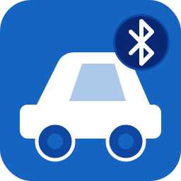

# Vehicle Bluetooth Tracker for Home Assistant

<p align="center">
  
</p>

A custom integration that turns the Companion App's Bluetooth Connection sensor on each driver's phone into a rich vehicle-state timeline: who drove, when, and for how long.

---

## Table of Contents

- [Why this exists](#why-this-exists)
- [Why Bluetooth only?](#why-bluetooth-only)
- [What it gives you](#what-it-gives-you)
- [How it works](#how-it-works)
- [Prerequisites](#prerequisites)
- [Installation](#installation)
- [Configuring a car](#configuring-a-car)
- [HACS submission status](#hacs-submission-status)
- [Development & tests](#development--tests)

---

## Why this exists

I wanted to know who took the car and when, so Home Assistant could:
- trigger automations on the parking gate when *my* car (and not the neighbour's) approaches,
- tell whether the car is at home without bolting GPS hardware onto it,
- remind the driver to stop the parking payment app,
- remind you to start the engine at least once a week to keep the battery healthy, in case you don't use your car frequently,
- work out who forgot to refuel after a long drive.

You could roll a single template sensor that does most of this in twenty lines of YAML. I didn't, because:
- I didn't want to write a duplicated YAML code block per driver and per car, and let other users do the same — I wanted a proper config flow with validation and a single source of truth for the car-driver mapping,
- I wanted it more robust (state restoration across restarts, smart handoff when one driver hops out and a passenger's phone is still connected, a logbook entry per drive),
- I wanted to learn how a "real" Home Assistant integration is wired,
- and because it's more fun.

## Why Bluetooth only?

There are already more capable alternatives out there — smart-car integrations (Tesla, BMW ConnectedDrive, Hyundai/Kia), OBD-II adapters with a Home Assistant add-on, or even Android Auto / CarPlay sensors. I deliberately chose not to use any of them:

- **No extra hardware.** An OBD dongle costs money and lives plugged into the car permanently. This integration needs only the phone that's already in your pocket.
- **Works for almost any car.** If your car has a Bluetooth stereo — including a plain aftermarket head unit — you're covered. No smart-car cloud account, no OBD port access, no Android Auto or CarPlay required.
- **No cloud dependency.** The data comes from the local Companion App sensor; nothing leaves your home network.

The trade-off is that Bluetooth connection is a *proxy* for driving, not proof. It turns on when you connect to the stereo and off when you leave the car (or park and disconnect the phone). For the use-cases above that's accurate enough, and the smart-handoff logic handles the edge case where a passenger's phone stays connected after the driver gets out.

## What it gives you

For each configured car you get one device with three entities:

| Entity | Type | Notes |
|---|---|---|
| `binary_sensor.<car>_in_use` | `occupancy` | On while any configured driver is connected to the car's Bluetooth. |
| `sensor.<car>_active_driver` | sensor | Current driver display name, or `idle`. Renders as a categorical history-graph timeline (`idle … Alice … Bob …`). Carries `last_driver`, `drive_start_time`, `last_drive_duration_minutes`, and `monitored_mac` attributes. |
| `sensor.<car>_last_drive_duration` | `duration` (min) | Carries the duration of the most recent completed drive. |

Each drive emits two events (`vehicle_bt_tracker_drive_started`, `vehicle_bt_tracker_drive_ended`) which a logbook describer renders as `Honda Civic — started driving with Alice` / `Honda Civic — finished a drive with Alice (23.4 min)`. Hook automations off them.

## How it works

Each driver's phone needs the Home Assistant Companion App with the **Bluetooth Connection** sensor enabled. That sensor exposes:

- `paired_devices` — every Bluetooth device the phone has ever paired with (used during config to populate the dropdown of cars).
- `connected_paired_devices` — the subset currently connected (used at runtime to detect "driving").

The integration just listens for state changes on those sensors and runs a small state machine. There's no BLE scanning, no extra services, no mocking around with raw advertisements — the Companion App does all the heavy lifting.

## Prerequisites

- Home Assistant 2024.1 or newer.
- Home Assistant Companion App installed on each driver's phone.
- The phone has been paired with the car at least once (otherwise nothing will show up in step 3 of the config flow).

### Enabling the Bluetooth Connection sensor

The sensor is off by default. You must enable it on **each** driver's phone before the integration can see the car.

**Android**

1. Open the Companion App and tap the **☰** menu → **Settings**.
2. Tap **Companion App** → **Manage sensors**.
3. Scroll to the *Connectivity* section and tap **Bluetooth Connection**.
4. Toggle **Enable sensor** on. The sensor entity appears in Home Assistant within a minute.

**iOS**

1. Open the Companion App and tap the **☰** menu → **Settings**.
2. Tap **Sensors**.
3. Find **Bluetooth Connection** and tap the toggle to enable it.

## Installation

### Via HACS (custom repository)

This integration isn't in the HACS default catalog yet, so add it as a custom repo:

1. HACS → *Integrations* → ⋮ (top right) → **Custom repositories**.
2. URL: `https://github.com/YuvalWS/ha-bt-vehicle-tracker`. Category: *Integration*.
3. Install **Vehicle Bluetooth Tracker** from the list.
4. Restart Home Assistant.
5. *Settings* → *Devices & Services* → *Add Integration* → search **Vehicle Bluetooth Tracker**.

### Manually

Copy `custom_components/vehicle_bt_tracker/` into your HA config directory under `config/custom_components/`, restart, then add the integration from *Devices & Services*.

## Configuring a car

The config flow has three steps:

1. **Vehicle name + driver phones.** Pick each driver's phone from a list that shows only registered Companion App devices — no digging through every sensor in your installation. The flow auto-discovers the Bluetooth Connection sensor on each device. If a phone's sensor isn't found (not enabled yet), you get a clear error naming which phone needs it fixed.
2. **Driver names.** The phone's device name (e.g. "Alice's iPhone") is pre-filled as the default — just hit *Submit* to accept it, or type something shorter.
3. **Car's Bluetooth device.** A dropdown of paired devices, pooled from all phones you selected. Pick the car.

To rename a driver, change the driver list, or change the car's MAC later, use the integration's **Configure** button — the options flow walks the same three steps.

### Integration icon

Brand images live in `custom_components/vehicle_bt_tracker/brand/` (supported since HA 2026.3):

```
brand/
├── icon.png   — 256 × 256, used in the integrations list and device cards
├── logo.png   — 480 × 100, used on the integration detail page
└── logo.svg   — source for logo.png (wide wordmark variant)
```

The square icon source is `logo.svg` at the integration root. If you edit either SVG, regenerate the PNGs with `cairosvg` (install once: `pip install cairosvg`):

```bash
python -c "
import cairosvg
cairosvg.svg2png(url='logo.svg', write_to='brand/icon.png', output_width=256, output_height=256)
cairosvg.svg2png(url='brand/logo.svg', write_to='brand/logo.png', output_width=480, output_height=100)
"
```

## HACS submission status

Custom repository for now. To get into the default HACS catalog the repo needs:
- a tagged release on GitHub (HACS won't index a repo without one),
- the manifest fields HACS validates (`integration_type`, `issue_tracker`, `requirements`, `documentation`, `version`) — already in place,
- a PR opened against [hacs/default](https://github.com/hacs/default) adding this repo's URL.

Until then the *Custom repositories* path above is the only install method, and that's fine — it works just as well, only the discovery is manual.

## Development & tests

```bash
python3 -m venv .venv
source .venv/bin/activate
pip install -r requirements_test.txt
pytest -v
```

The suite covers the state machine, both flow steps (config + options), the four entities, the logbook describer, and the misconfigured-driver-sensor warning paths. See [tests/](tests/).
